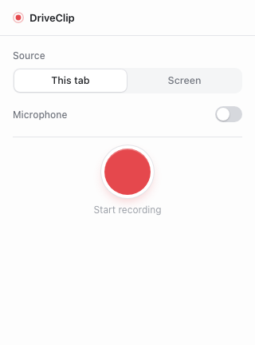
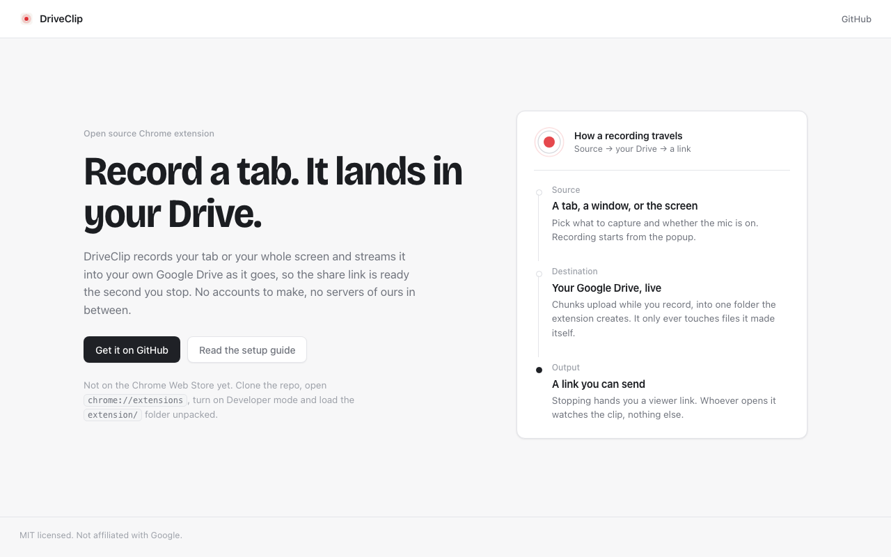

# DriveClip

A minimal, open-source screen recorder for Chrome that streams straight into **your own
Google Drive**. Hit record, talk over your tab or your desktop, hit stop, and you get a
share link in a second or two — because the video was already uploading while you were
recording it.

No server, no account, no storage bill. The extension talks directly to the Drive API
with a single `drive.file` scope, and the "player page" is a static site you host
yourself (or point at ours). Nothing in the middle ever sees your video.

> Not affiliated with, endorsed by, or connected to Google or Loom. "Google Drive" is a
> trademark of Google LLC.

<p align="center">
  
  &nbsp;&nbsp;
  
</p>

## Set it up with an AI agent

This repo is written to be **agent-first**: [AGENTS.md](AGENTS.md) is a machine-followable
runbook covering setup, deploys, verification commands, the message contracts, and every
Chrome-API sharp edge we already hit so your agent doesn't rediscover them. If you use
Claude Code, Cursor, or any coding agent, this prompt is enough:

> Clone https://github.com/joelborch/driveclip and follow AGENTS.md to set it up.
> Walk me through the Google Cloud console steps I have to click myself, and verify
> the acceptance checklist at the end.

The only steps an agent can't do for you are approving Google's OAuth consent screens
and clicking "Allow" on permission prompts — everything else is in the runbook.

## Features

- Record the **current tab** (with tab audio) or the **whole desktop / a window**.
- Optional **mic narration**, mixed with the captured audio in a Web Audio graph so tab
  sound stays audible to you while it's being recorded.
- **Streaming upload**: MediaRecorder emits a chunk every 3 s, and those chunks are fed
  into a Drive resumable-upload session in 4 MiB slices *during* the recording. When you
  press stop, usually only the tail is left to send.
- **One folder, one permission**: DriveClip creates a `DriveClip Recordings` folder on
  first connect and sets `anyone / reader` on the folder once. Every recording inherits
  link-visibility from it, so there is no per-file permission round-trip.
- **Share link** points at the static dashboard, which embeds Drive's own player in a
  clean 16:9 page. A secondary "Open in Drive" link is always available as a fallback.
- VP9/Opus WebM at 8 Mbps when the browser supports it, VP8 otherwise.

## Architecture

Five pieces, deliberately small and boring:

- **`extension/popup/`** — the entire UI. It holds no recording state of its own; it asks
  the service worker for a `State` object and renders whatever it gets, polling once a
  second while recording. That's why you can close and reopen the popup mid-recording
  without confusing it.
- **`extension/background/service-worker.js`** — the brain. Owns the state machine
  (`idle → recording → uploading → done | error`), does OAuth via
  `chrome.identity.getAuthToken`, grabs the tab capture stream id, creates and tears down
  the offscreen document, and mirrors state into `chrome.storage.session`.
- **`extension/offscreen/`** — the hands. A service worker can't touch `MediaRecorder` or
  `getUserMedia`, so all capture, the audio mixing graph, and the upload pump live in an
  offscreen document. It reports progress and the final file id back to the worker.
- **`extension/lib/drive.js`** — pure `fetch` against the Drive v3 API: folder
  ensure/create, resumable session creation, and a `ChunkedUploader` that serializes
  slices, handles `308 Resume Incomplete`, refreshes an expired token once on `401`, and
  backs off on `5xx`. It makes no `chrome.*` calls, so it's trivially testable.
- **`dashboard/`** — a static site (`index.html`, `v.html`, `404.html`, `style.css`) with
  no build step. The viewer pulls the file id out of `/v/<id>`, validates it against
  `[A-Za-z0-9_-]{10,}`, and drops it into a Drive `/preview` iframe.

Message flow, end to end:

```
popup ──start-recording──▶ service worker ──offscreen-start──▶ offscreen doc
                                  ▲                                 │
                                  └── recording-started ────────────┤
                                  └── upload-progress ──────────────┤
                                  └── recording-complete ───────────┘
                                                                    │
                            Drive resumable session ◀───── PUT slices
```

## Install (unpacked)

1. Clone this repo.
2. Follow **[docs/SETUP.md](docs/SETUP.md)** to create a Google Cloud project, enable the
   Drive API, and mint a Chrome Extension OAuth client id. You'll load the extension once
   to read its id, paste that into the Cloud console, then paste the client id back into
   `extension/manifest.json`.
3. Open `chrome://extensions`, turn on **Developer mode**, click **Load unpacked**, and
   select the `extension/` directory.
4. Pin DriveClip, open the popup, click **Connect Google Drive**, and approve the consent
   screen. This creates the `DriveClip Recordings` folder.
5. Pick Tab or Desktop, toggle the mic, hit **Record**.

Chrome 116 or newer is required (offscreen documents with the `DISPLAY_MEDIA` reason).

## Deploying the dashboard

The dashboard is static files, so any host works, but Cloudflare Pages is the path of
least resistance:

1. Create a Pages project pointed at this repo.
2. Set **build command** to nothing at all and **build output directory** to `dashboard`.
3. Deploy. `404.html` is a verbatim copy of `v.html`, which is what makes clean
   `/v/<FILE_ID>` URLs work — Pages serves `404.html` for any unmatched path, and the
   viewer script reads the id off `location.pathname`.
4. Set `SHARE_BASE` in `extension/lib/config.js` to your deployed base, including the
   trailing slash: `export const SHARE_BASE = 'https://your-project.pages.dev/v/'`.
5. Reload the extension so the new constant takes effect.

If you skip all of this, recordings still work — the "Open in Drive" link in the popup
goes straight to `https://drive.google.com/file/d/<id>/view`.

## Known limitations

**WebM duration metadata isn't patched.** MediaRecorder writes a live-stream WebM whose
header has no duration, and DriveClip streams chunks out as they arrive, so there's no
opportunity to rewrite the header afterwards. In practice this is fine: Drive transcodes
uploaded video and its player gives you a proper seekable timeline within a minute or two
of upload. If you download the raw `.webm` and open it in a local player before that,
expect a missing or wrong duration and jumpy seeking.

**Drive throttles heavily-viewed files.** A recording that suddenly gets thousands of
views can hit Google's per-file traffic quota and start showing "Sorry, you can't view or
download this file at this time." That's a Drive property, not something the extension can
work around. DriveClip is built for team-sized audiences, not for publishing.

**Recording does not survive Chrome closing.** Chunks live in an in-memory queue until
their upload slice is acknowledged, and there's no IndexedDB journal in v1. If Chrome
quits, crashes, or the profile is killed mid-recording, whatever hadn't been acknowledged
is gone and you're left with a partial file in Drive. Likewise, the service worker resets
any stale non-idle state to `idle` on startup rather than trying to resume.

**One recording at a time**, and closing the popup is safe but closing the *browser* is
not. Ending the share from Chrome's own "Stop sharing" bar is handled and finalizes the
upload normally.

**Consent screen stays in Testing mode** unless you verify the app. That's fine for
personal or small-team use; see the note at the end of `docs/SETUP.md`.

## License

MIT. Written from scratch — no code copied from GPL-licensed projects.
